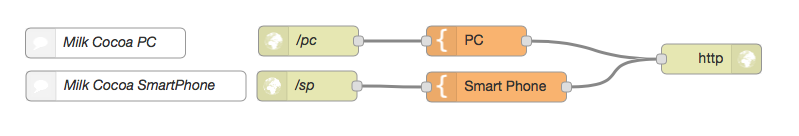
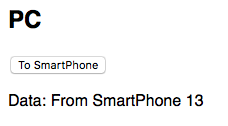
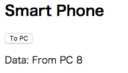

# Readme MQTT-Milkcocoa

##1. Abstract

Milkcocoaのサービスを利用してMQTTのTrialを行った。言語はJavaScriptである。HTMLとそれにembedしたJavaScriptのコードを２種類作成しWeb Serverに置く。２つのクライアント上のBrowser(ChromeとSafari)でそれぞれのHTMLをアクセスし、Client間相互にメッセージをpushできることを確認した。

##2. Milkcocoa

MilkcocoaはMQTTのサービスを提供している。ある条件のもとで無料で利用できる。JavaScript用のAPIを利用した。

###準備

- "https://mlkcca.com" にアクセしてアカウントを作成し、ログインする。
- 「新しいアプリを作る」ボタンをクリックし、App Nameを入力してアプリを作成する。
- 作成したアプリの右側に app\_id: xxxx と表示される。
- 作成したアプリをクリックし、左側の「認証」タブをクリックする
- 「新しいAPI KeyとAPI Secretのペアを生成する」ボタンをクリックする
- app\_id, API KeyとAPI Secretの値をJavaScript内で利用する

##3. Test環境
Web Serverとして以下の２パターンで動作確認した。どちらもInternetに接続する必要がある。

- Mac上で動作しているApacheを利用した場合
- Mac上で動作しているNode-REDを利用した場合

Web serverに置くfileは以下の構成の２つのindex.htmlである。ただしindex.html内のapp\_id, API KeyとAPI Secretの値は２章で取得した値に変更すること。   

```
---test-+-pc---index.html
        |
        +-sp---index.html
```

Apacheの場合、test folderをApacheのdefault home directoryの "/Library/WebServer/Documents" に置く。  
Node-REDの場合、以下の"PC"と"Smart Phone"のそれぞれのtemplate nodeにHTMLをコピペする。


Mac/PC/iPhoneのbrowserから上記web server上のindex.htmlをアクセスすると、それぞれ以下の表示画面となる。PC側の「To Smart Phone」のボタンをクリックするとSmart Phone側の表示がupdateされる。Smart Phone側の「To Smart Phone」のボタンをクリックするとSmart Phone側の表示がupdateされる。これにより双方向のPUSH通信ができていることがわかる。




### Note: Smart Phoneをキャリアのネットワークに接続した場合の動作確認方法

上記の動作確認ではMQTTはインターネットのサーバーを利用しているが、index.htmlはLAN内のローカルサーバーにアクセスしている。そのためSmart Phoneのネットワーク接続を「Wi-Fi:OFF, モバイルデータ通信:ON」とした設定ではsp側のindex.htmlをアクセスできない。このネットワーク接続で動作確認を行うには、sp側のindex.htmlをdropboxを使ってSmart Phoneと共有すればいい。

##4. Source Code

最初にMilkCocoa Objectを作成する。引数としてApp\_Id, API\_Key, API\_Secretを設定する。  
次にData Storeを作成する。このData Store単位でPublish/Subscribeする。

```JavaScript
// create MilkCocoa object (milkcocoa serverに接続)
    var milkcocoa = MilkCocoa.connectWithApiKey(App_Id, API_Key, API_Secret);
    // create Data Store object
    var dsToPC = milkcocoa.dataStore('toPC');
    var dsToSP = milkcocoa.dataStore('toSP');
```

送信はメッセージを引数としてData Storeオブジェクトのsendまたはpushメソッドを実行する。pushの場合はメッセージがサーバーにstoreされる。メッセージはJSON形式である。  

```
// 送信処理
dsToPC.send({category: "echonetlite", 
              device: "AirConditioner_1", 
              func: "setOperatingMode", 
              param: "data " + n
             });             // send
```

受信はCall Back処理される。value propertyにメッセージが格納されているので、keyを指定してデータを取り出す。

```
// 受信処理
dsToSP.on('send', receiveData);
function receiveData(sent){
   console.log("receiveData");
	output1.innerHTML = 'category: ' + sent.value.category;
	output2.innerHTML = 'device: ' + sent.value.device;
	output3.innerHTML = 'func: ' + sent.value.func;
	output4.innerHTML = 'param: ' + sent.value.param;
}
```


以下にindex.htmlのソースコードを全て示す。

```
<!-- index.html for sp-->
<!-- test_7 -->
<!-- test about milkcocoa with simple data -->

<html>
<head>
  <meta charset="UTF-8">
  <meta name="viewport" content="width=device-width, initial-scale=1, minimum-scale=1">
  <title>Milk Cocoa Test SP側</title>
  <style>
  * { font-family: sans-serif }
  </style>
</head>
<body>
  <h2> Smart Phone </h2>
  <input type="button" value="To PC" onclick="ButtonClickUpdate()"/>
  <p id="output1"></p>
  <p id="output2"></p>
  <p id="output3"></p>
  <p id="output4"></p>
  <script src='https://cdn.mlkcca.com/v0.6.0/milkcocoa.js'></script>
  <script>
    var n = 0;
	// app_id, API_Key, API_Secretは自分のものに書き換えてください
	var App_Id = 'vueizqbi179.mlkcca.com';
	var API_Key = 'LJCBGLCPOEPEGFFP';
	var API_Secret = 'lYMejakSknAfLXYZTZVPSjMVePRHCkIHWbJleLBm';

    // create MilkCocoa object (milkcocoa serverに接続)
	var milkcocoa = MilkCocoa.connectWithApiKey(App_Id, API_Key, API_Secret);
    // create Data Store object
	var dsToPC = milkcocoa.dataStore('toPC');
    var dsToSP = milkcocoa.dataStore('toSP');
    
    // 受信処理
	dsToSP.on('send', receiveData);
	function receiveData(sent){
	    console.log("receiveData");
		output1.innerHTML = 'category: ' + sent.value.category;
		output2.innerHTML = 'device: ' + sent.value.device;
		output3.innerHTML = 'func: ' + sent.value.func;
		output4.innerHTML = 'param: ' + sent.value.param;
	}

    // 送信処理
    function ButtonClickUpdate() {
	    n += 1;
		dsToPC.send({category: "echonetlite", 
                     device: "AirConditioner_1", 
                     func: "setOperatingMode", 
                     param: "data " + n
                    });             // send
		dsToPC.push({category: "echonetlite", 
                     device: "AirConditioner_1", 
                     func: "setOperatingMode", 
                     param: "data " + n
                    });             // send and store
    }
	</script>
</body>
</html>

```

```
<!-- index.html for PC -->
<!-- test_7 -->
<!-- test about milkcocoa with simple data -->

<html>
<head>
  <meta charset="UTF-8">
  <meta name="viewport" content="width=device-width, initial-scale=1, minimum-scale=1">
  <title>Milk Cocoa Test PC側</title>
  <style>
  * { font-family: sans-serif }
  </style>
</head>
<body>
  <h2> PC </h2>
  <input type="button" value="To SmartPhone" onclick="ButtonClickUpdate()"/>
  <p id="output1"></p>
  <p id="output2"></p>
  <p id="output3"></p>
  <p id="output4"></p>
  <script src='https://cdn.mlkcca.com/v0.6.0/milkcocoa.js'></script>
  <script>
    var n = 0;
	// app_id, API_Key, API_Secretは自分のものに書き換えてください
	var App_Id = 'vueizqbi179.mlkcca.com';
	var API_Key = 'LJCBGLCPOEPEGFFP';
	var API_Secret = 'lYMejakSknAfLXYZTZVPSjMVePRHCkIHWbJleLBm';

    // create MilkCocoa object (milkcocoa serverに接続)
	var milkcocoa = MilkCocoa.connectWithApiKey(App_Id, API_Key, API_Secret);
    // create Data Store object
	var dsToPC = milkcocoa.dataStore('toPC');
    var dsToSP = milkcocoa.dataStore('toSP');
    
    // 受信処理
	dsToPC.on('send', receiveData);
	function receiveData(sent){
	    console.log("receiveData");
		output1.innerHTML = 'category: ' + sent.value.category;
		output2.innerHTML = 'device: ' + sent.value.device;
		output3.innerHTML = 'func: ' + sent.value.func;
		output4.innerHTML = 'param: ' + sent.value.param;     
	}

    // 送信処理
    function ButtonClickUpdate() {
	    n += 1;
		dsToSP.send({category: "echonetlite", 
                     device: "Lighting_1", 
                     func: "setTemperature", 
                     param: "data " + n
                    });             // send
		dsToSP.push({category: "echonetlite", 
                     device: "Lighting_1", 
                     func: "setTemperature", 
                     param: "data " + n
                    });             // send and store
    }
  </script>
</body>
</html>

```
##5. 注意事項
無料の条件の一つに「コネクション数の最大が20」というものがある。

```
var milkcocoa = MilkCocoa.connectWithApiKey(App_Id, API_Key, API_Secret);
```

これを実行するとコネクション数が１増える。したがってプログラム内ではこのオブジェクトを使い回す必要がある。
例えば送信の度にこのオブジェクトを作成すると、コネクション数が20になった時点で通信ができなくなる。コネクション数はMilkcocoaのサーバーの各アプリのページで確認できる。